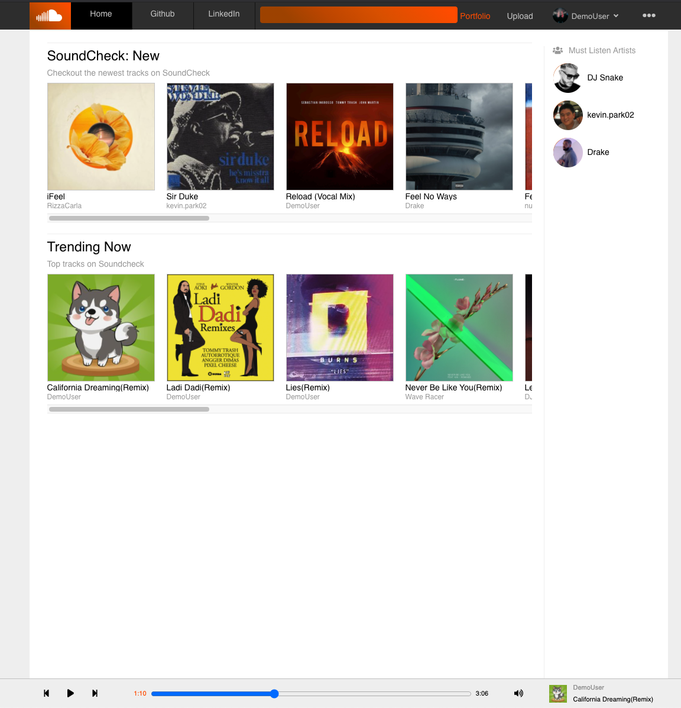
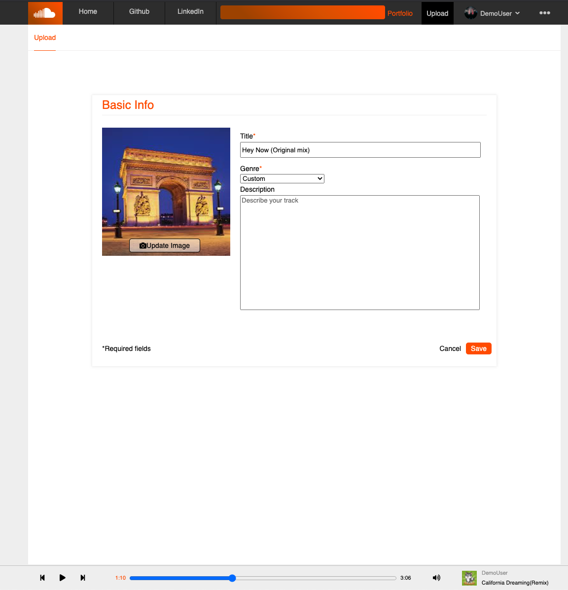

# SoundCheck 

[SoundCheck](https://cjsoundcheck.herokuapp.com/#/) is a [Soundcloud](https://soundcloud.com/) clone. It is a very popular music platform where artists from all parts of the music industry, either big or small have come to upload and share their music. Any user can upload a song and let it be heard by anyone around the world, free of charge. 

# Technologies Used 

### Hosting
* AWS S3 
* Heroku

### Frontend
* CSS/SCSS
* Javascript
* React.js
* Redux.js
* Wavesurfer.js 

### Backend
* Ruby on Rails
* PostgreSQL

# Features

## User Authentication

* Users are able to sign up, log in, and log out

## Discover Home

* All users who login/signup are greeted with a Discover page that lists all the tracks available on Soundcheck!

## Upload

* Users are able to upload songs along with any photo they'd like.

## Song Page

* Every song has their own page with working Play button, like button, and comment section.

## Music Player

* Users are able to pick a song on the site and have it continuously play while they browse on other pages. 
* Player bar has full functionality of pause, play, skip, and volume. 

## User Profile

* Each user has their own profile page that shows the number of tracks they've uploaded and an interactable waveform of each song. 

## WaveSurfer.js

 * Wavesurfer.js API uses HTML5 and Canvas to analyze song files and draw a interact-able waveform.
 * Users are able to scrub the song to the place they want and the time is sent to the custom audio player to play it. 
 * A Waveform class was made and using React lifecycle components such as ComponentDidMount/ComponentDidUpdate and vanilla DOM JS, the connection between Wavesurfer.js and the custom audio player at the bottom of the page was able to be achieved. 

